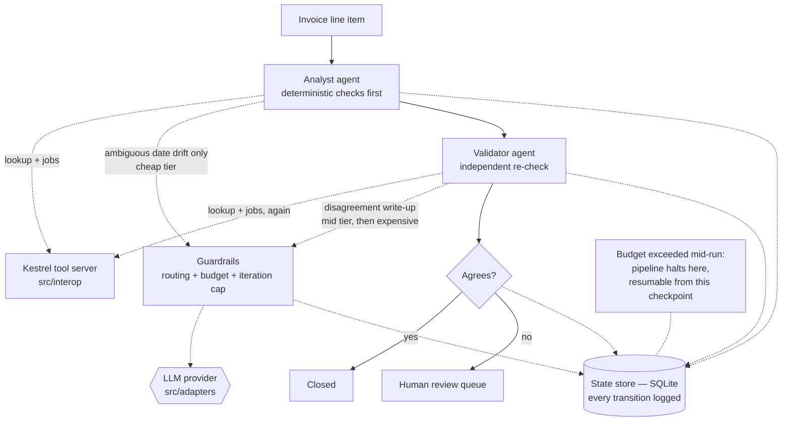
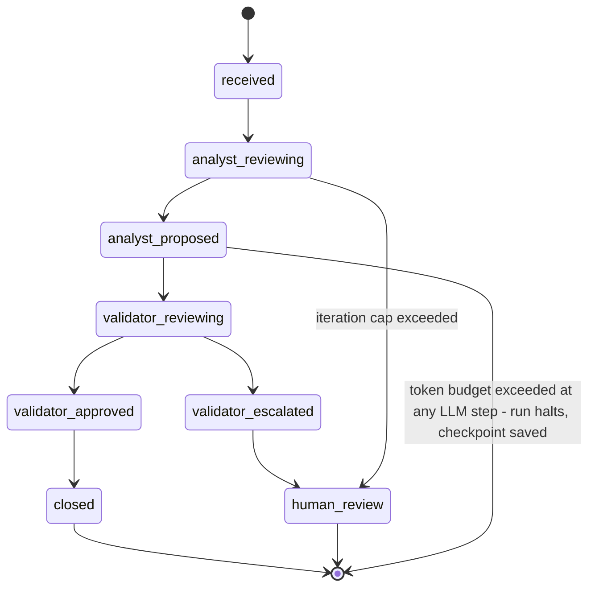

# Orchestration architecture: agent topology and state machine

This document covers `src/orchestration`'s invoice-reconciliation workflow: how the
Analyst and Validator agents communicate, and the explicit state machine every invoice
moves through. Both diagrams below were rendered and visually verified with
`@mermaid-js/mermaid-cli` before being committed — GitHub renders the same Mermaid
source natively in this file.

## Agent communication topology

Every invoice goes through the Analyst first, then the Validator, never the reverse.
Both agents call the same `src/interop` tool server independently — the Validator does
not receive the Analyst's tool results, it re-derives its own from scratch. Both agents
route any LLM call through `Guardrails`, which is the only path to the model adapter
layer and the only place cost, budget, and iteration limits are enforced.



Two things this diagram is deliberately explicit about:

- **The Validator never sees the Analyst's tool results, only its conclusion.** It calls
  `lookup_customer` and `get_customer_jobs` itself, independently, and compares its own
  finding to the `AnalystProposal` it was handed. This is what makes "independent
  verification" real rather than a rubber stamp — see
  `docs/architecture/0001-deterministic-first-entity-resolution.md` for the sibling
  principle this extends from `src/interop`.
- **The routing table has three tiers, and the expensive tier is reached by a documented
  criterion, not by default.** The Analyst's ambiguous-date judgment always uses the cheap
  tier. The Validator's disagreement write-up starts at the mid tier; only when the
  pipeline calls `confirm_escalation` (a second opinion before bothering a human) does the
  expensive tier get used.

## Reconciliation state machine

Every invoice's `task_id` moves through this state machine exactly once per pipeline run,
and every transition is written to the state store before the pipeline moves on — see
`StateStore.log_transition` in `src/orchestration/state_store.py`.



Two exception paths are part of the state machine, not bolted on around it:

- **Iteration cap exceeded** escalates only the one task that hit it, straight to human
  review with a note — the rest of the batch keeps processing.
- **Token budget exceeded** halts the whole run. It's drawn here from `analyst_proposed`
  for readability, but the guardrail can fire at any of the three LLM-touching points
  (the Analyst's ambiguous-date call, or either of the Validator's write-up calls). The
  run's `resume_index` is saved at the moment of the halt, and
  `resume_reconciliation()` continues from exactly that invoice — nothing already closed
  gets reprocessed.

## Regenerating these diagrams

```sh
npx -y @mermaid-js/mermaid-cli -i topology.mmd -o topology.png
npx -y @mermaid-js/mermaid-cli -i statemachine.mmd -o statemachine.png
```

Always render before committing a diagram change. A Mermaid label containing `<br/>`
inside a `stateDiagram-v2` transition (as opposed to a flowchart node) will parse into
disconnected phantom nodes instead of raising a clear error — the failure mode is silent
corruption of the diagram, not a build break, which is exactly the kind of mistake that
looks fine in a text editor and wrong in a browser.
